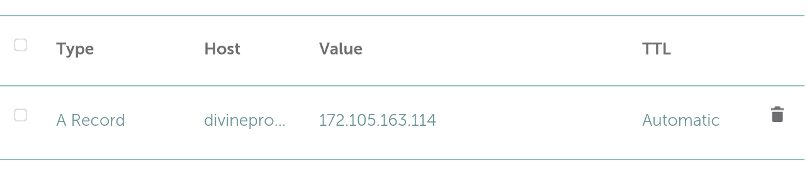

# Deploying a React app with Nginx and let's encrypt
Welcome to this comprehensive guide on deploying a React app securely with Nginx and Let's Encrypt. 

## Linux system setup

1. update the system
```bash
apt update -y
```

2. create a system user and provide it sudo privileges
```bash
adduser react
```

```bash
usermod -aG sudo react

```

```bash
logout
```

3. On your local computer, create rsa key pair if you haven't done it before.
```bash
ssh-keygen -b 4096 -t rsa
```

4. Follow the prompt on step 3 until it completes.

5. send the public key to the remote server
```bash
ssh-copy-id react@X.X.X.X
```

6. login and you won't have to provide any password
```bash
ssh react@X.X.X.X
```

7. Find the path to the file that has lines with word "permitRootLogin" and "passwordauthentication".
```bash
sudo grep -ir "permitrootlogin" /etc
```

```bash
sudo grep -ir "passwordauthentication" /etc
```

8. Disable root login and password authentication for extra security.
```bash
sudo sed -i 's/PermitRootLogin yes/PermitRootLogin no/' /etc/ssh/sshd_configsed 
```

```bash
sudo sed -i 's/PasswordAuthentication yes/PasswordAuthentication no/' /etc/ssh/sshd_config
```

```bash
sudo systemctl restart ssh
```

9. confirm root and password based authentication is disabled by trying to log in with root and any random username. Server should not prompt for password.

10. give a server descriptive name
```bash
sudo hostnamectl set-hostname React
```

11. update hostname in hostfile
```bash
sudo sed -i '/^127.0.0.1/s/localhost/React' /etc/hosts
```

12. logout and login in order to have hostname effective

```bash
logout
```

```bash
ssh react@public_ip_address
```

13. Install ufw firewall and only allow connection on port 22 and 80 and 443. You must ensure the port for ssh service is open. usually port 22 is used for ssh service.

```bash
sudo apt update -y
sudo apt install ufw
sudo ufw allow ssh
sudo ufw allow http
sudo ufw allow https
sudo ufw enable
```

14. Check the system time and local time zone are correct for you and your users.
```bash
timedatectl
```

15. To set the timezone on the remote server to your local time zone, simply create a symblic link as follow. In this example: I am setting local time on the system to Australia/Melbourne time.

```bash
sudo ln -sf /usr/share/zoneinfo/Australia/Melbourne /etc/localtime
```

16. keep the system time accurate with ntp server
```bash
sudo apt install ntp
```

```bash
sudo apt start ntp
```

```bash
sudo apt enable ntp
```

17. Confirm the system time is accurate to your local time zone
```bash
date
```

## Installing and Configurig Nginx

18. update the system and install nginx
```bash
sudo apt update -y
sudo apt install nginx -y
```
19. copy the default site config into your site. i'm copying default site config to my new site: grocery-app

```bash
sudo cp /etc/nginx/sites-available/default /etc/nginx/sites-available/grocery-app
```
20. update the grocery-app site with following content. replace server name with the server's ip or your domain name if you have your server's ip registered with your domain.
```bash
server {
	listen 80;
	root /var/www/html/grocery-app;

	# Add index.php to the list if you are using PHP
	index index.html index.htm index.nginx-debian.html;

	server_name 172.105.163.114;

	location / {
		# First attempt to serve request as file, then
		# as directory, then fall back to displaying a 404.
		try_files $uri $uri/ =404;
	}

}
```
21. create directory /var/www/html/grocery-app to store built files for our react app and set the appropriate permission and ownership
```bash
sudo mkdir -p /var/www/html/grocery-app
```

```bash
sudo chmod -R 774  /var/www/html/grocery-app/
```

```bash
sudo chown -R $USER:$USER /var/www/html/grocery-app/
```

22. Create a symbolic link from sites-avaiable/ to sites-enabled/
```bash
sudo ln -s /etc/nginx/sites-available/grocery-app /etc/nginx/sites-enabled/
```

23. Ensure that the config is okay. This test shuld return a message saying that the test is successful.
```bash
sudo nginx -t
```

24. Create a test file
```bash
sudo nano /var/www/html/grocery-app/index.html
```
25. Restart nginx
```bash
sudo systemctl restart nginx.service 
```

26. Try accessing the server at http://server_public_ip and you should see the content of index.html

## Get your production built ready and send it to the server

27. Run a build command to get a producton ready built on the local laptop
```bash
npm run build
```

28. Remove the previous test index.html file

29. Send the content of build folder to the remote server on our site directory
```bash
 scp -r build/* react@server_public_ip:/var/www/html/grocery-app
```

30. Restart nginx service
```bash
sudo service nginx restart
```
31. Access the web app at http://server_public_ip_address


## Register the public IP address with your domain

32. Register A record pointing to your server's IP as follow:
``` bash
Set host = subdomains
Type : A record
host : desired subdomains (divineprovisions in my case)
Value : public_ip_address
```



33. Replace server_name in /etc/nginx/sites-available/grocery-app with your domain name. After replacing the server's ip, it should look like this:
```bash
server {
        listen 80;
        root /var/www/html/grocery-app;

        # Add index.php to the list if you are using PHP
        index index.html index.htm index.nginx-debian.html;

        server_name divineprovisions.prabinkc.com;

        location / {
                # First attempt to serve request as file, then
                # as directory, then fall back to displaying a 404.
                try_files $uri $uri/ =404;
        }

}
```

## Encrypting connection with SSL certificate

34. install certbot
```bash
sudo apt update -y
sudo apt install certbot python3-certbot-nginx
``` 

35. obtain SSL certificate by running following command. Follow the prompt.
```bash
sudo certbot --nginx -d divineprovisions.prabinkc.com
```

36. Check the nginx configuration and ensure test is successful.
```bash
sudo nginx -t
```

37. Reload the nginx
```bash
sudo service nginx reload
```
Follow these steps carefully to ensure a secure and smooth deployment of your React app with Nginx and Let's Encrypt.